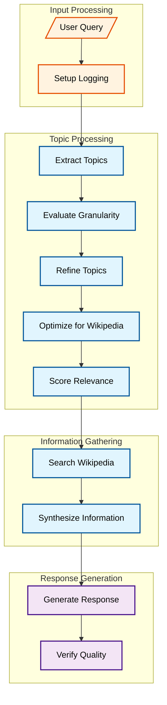

The diagram shows the system's four main stages, color-coded for clarity:

- Orange boxes show input processing steps
- Blue boxes represent processing and transformation steps
- Purple boxes indicate output generation steps

Let's examine each component in detail:

### Input Processing

1. **User Query**: The system accepts a user's query through the command line interface
2. **Setup Logging**: Configures logging system for tracking operations and errors 0:4

### Topic Processing

1. **Extract Topics**: Uses the LLM to identify key topics from the query
2. **Evaluate Granularity**: Determines if topics are too broad or too narrow
3. **Refine Topics**: Adjusts topic scope based on evaluation results
4. **Optimize for Wikipedia**: Converts topics into Wikipedia-friendly search terms
5. **Score Relevance**: Evaluates how relevant each topic is to the original query

### Information Gathering

1. **Search Wikipedia**: Performs concurrent searches for relevant topics
2. **Synthesize Information**: Combines search results into a coherent knowledge base

### Response Generation

1. **Generate Response**: Creates an initial answer using the synthesized information
2. **Verify Quality**: Checks the response for accuracy and completeness

The system uses several key techniques to ensure reliability:

- Concurrent processing for efficient Wikipedia searches 1:1
- Caching to avoid duplicate queries
- Comprehensive error handling at each stage
- Rate limiting to prevent API overload

Each stage builds upon the previous one, creating a robust pipeline that transforms a simple query into a comprehensive, verified response. The system maintains quality through continuous validation and refinement at each step.
